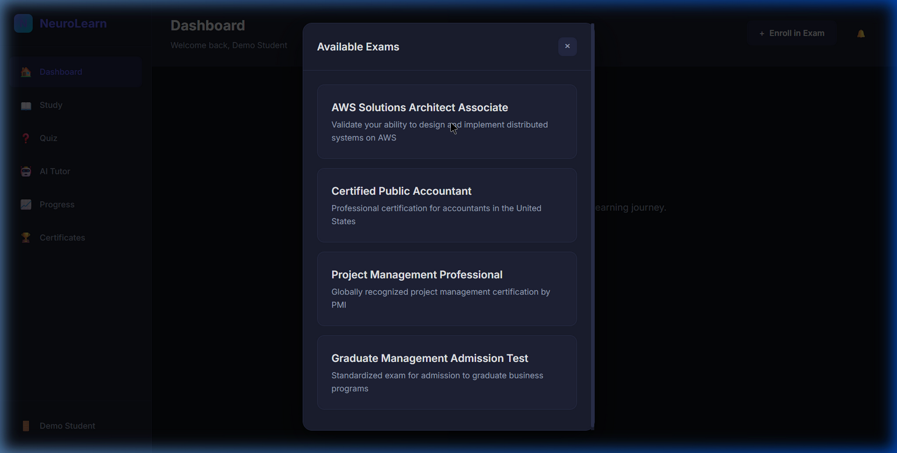
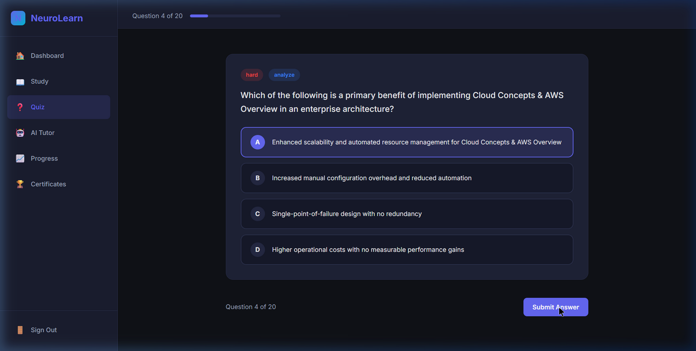
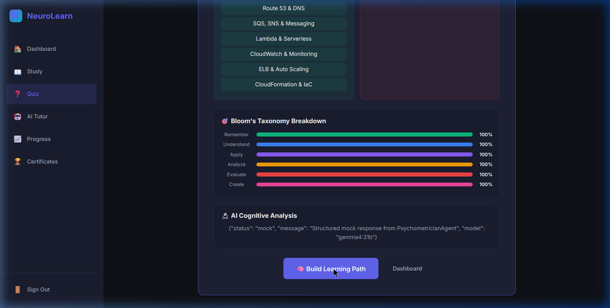
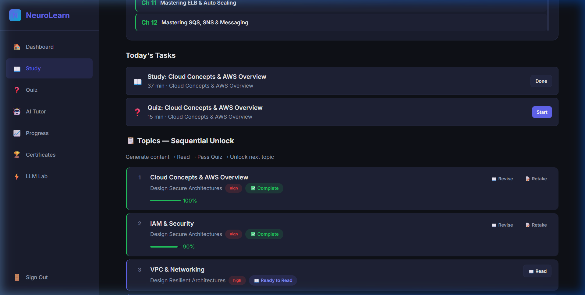
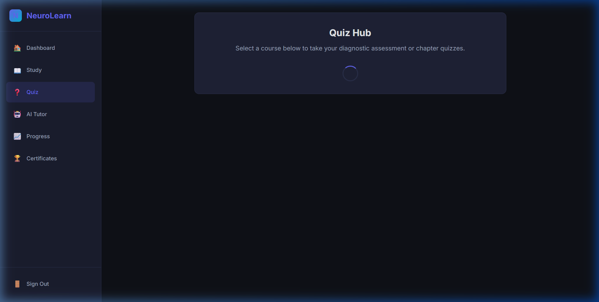

# NeuroLearn — Multi-Agent AI for Personalized Adaptive Learning



NeuroLearn is a state-of-the-art, production-ready educational platform that leverages **Multi-Agent Large Language Models (LLMs)** to deliver a highly personalized, adaptive learning experience. By combining real-time psychometric evaluation (Item Response Theory), dynamic multi-agent content generation, and interactive streaming UIs, NeuroLearn creates a study path specifically tailored to each student's strengths, weaknesses, and cognitive abilities.

---

## 🌟 Key Features

### 1. IRT-Based Diagnostic Assessment
Instead of a static placement test, NeuroLearn uses an adaptive assessment engine. 
* **Real-time SSE Streaming:** Questions are generated on the fly and streamed directly to the UI, providing a seamless "zero-wait" experience.
* **Deep Psychometric Analysis:** Evaluates students not just on right/wrong answers, but on **Bloom's Taxonomy** levels (Remember, Understand, Apply, Analyze, Evaluate, Create) to determine their true cognitive mastery.



### 2. Rich Analytical Insights
Upon completing a diagnostic or chapter quiz, the platform visualizes the psychometric data:
* **Strengths & Needs Improvement Cards:** Pinpoints exactly which topics require attention.
* **Bloom's Taxonomy Breakdown:** Visual charts showing cognitive depth.
* **AI Cognitive Analysis:** Detailed feedback generated by a specialized `PsychometricianAgent`.



### 3. Dual-Model Multi-Agent Content Pipeline
Content isn't just generated by a single prompt; it is curated through a robust agentic workflow:
* **Model A & Model B Generation:** Two distinct LLMs draft competing study materials.
* **CriticAgent Voting:** A third AI acts as a judge, evaluating both drafts against educational standards to select the superior material.
* **Comprehensive Subtopics:** The winning content is structured with deep dives into "Why?", "When?", "How?", and "Advantages vs. Disadvantages", automatically parsed into subtopics for UI tracking.



### 4. Interactive Quiz Hub & Study Dashboard
* **Standalone Quiz Hub:** Easily access your diagnostic quizzes or retake chapter quizzes.
* **Visual Progress Tracking:** SVG-based reading progress rings that dynamically track "Chapters Read vs. Content Generated".
* **Topic-by-Topic Unlocking:** Content is generated asynchronously, and chapters unlock sequentially as you prove mastery.



---

## 🤖 The Multi-Agent & Dual-Model Architecture Explained

NeuroLearn breaks away from relying on a single monolithic AI. Instead, it delegates tasks to specialized AI "personas" (Agents), creating an ecosystem that mimics a real educational institution.

### The Dual-Model Content Pipeline
When a student requests study material, we don't just prompt one model. We use a **Dual-Model + Critic Pipeline** (like a writer's room with a strict editor):
1. **Drafting:** `Model A` generates a comprehensive study guide. Simultaneously, `Model B` generates a completely different version.
2. **Reviewing:** A third AI, the `CriticAgent`, acts as the judge and reads both drafts.
3. **Voting:** The Critic evaluates them based on clarity, depth, and whether they answered "Why, When, and How". It then selects the winner.
4. **Publishing:** Only the winning draft is saved to the database and presented to the student.

*Example:* For a "Cloud Computing" chapter, Model A might write a highly technical explanation, while Model B might use a relatable analogy (renting vs. buying a house). The Critic decides which explanation best fits the student's difficulty level and learning style.

### The Agent Roster & Use Cases

* 🧑‍🏫 **ProctorAgent (The Exam Creator):** Strictly trained to output valid JSON arrays containing questions, options, and difficulty weights. 
  * *Use Case:* Rapidly generating the 20-question Diagnostic Quiz tailored to your target exam and tracking your "Bloom's Taxonomy" cognitive levels.
* 🧠 **PsychometricianAgent (The Data Analyst):** Takes quiz results and applies Item Response Theory (IRT) to calculate true cognitive ability (Theta).
  * *Use Case:* Analyzing *which* questions you got wrong to generate the "AI Cognitive Analysis" feedback (e.g., *"You understand definitions, but are hitting a conceptual plateau in application scenarios."*).
* 🏗️ **PathArchitectAgent (The Curriculum Designer):** Looks at your cognitive profile and available study time to build a schedule.
  * *Use Case:* Generating the sequential Study Path, prioritizing your weak topics first, and calculating necessary "buffer days" for revision.
* 📚 **ContentCuratorAgent (The Author):** Coordinates the dual-model generation process.
  * *Use Case:* Triggering the generation of Chapter 1 and ensuring it contains highly comprehensive subtopics.
* 💬 **TutorAgent & QA Router (The 24/7 TA):** Uses RAG (Retrieval-Augmented Generation) to search through your specific generated study materials.
  * *Use Case:* When you ask the AI Tutor a question, it searches your generated chapters to provide a localized answer, preventing hallucinations of external information.

---

## 🏗️ Architecture

NeuroLearn is built on a modern, robust technology stack designed for high throughput and transparent AI operations.

### Backend (`FastAPI` + `Python`)
* **Multi-Agent Orchestration:** Powered by `BaseAgent` abstractions connecting to Ollama (or other LLM providers). Agents include `ProctorAgent` (Quiz generation), `ContentCuratorAgent` (Dual-model generation), `CriticAgent` (Voting), and `PathArchitectAgent` (Syllabus building).
* **Server-Sent Events (SSE):** Heavy use of `StreamingResponse` to push real-time agent updates (e.g., "🤖 Model A generating...", "🧑‍⚖️ Critic evaluating...") directly to the frontend.
* **Database:** SQLAlchemy ORM running on SQLite (easily migratable to PostgreSQL/MySQL) for tracking enrollments, generated content, and fine-grained `QuizSession` data.
* **Vector Store:** Integrated ChromaDB for Retrieval-Augmented Generation (RAG) capabilities during Q&A tutoring.

### Frontend (`Vanilla JS` + `HTML/CSS`)
* **Framework-Free Performance:** Built without React/Vue to ensure maximum lightweight performance and complete control over the DOM.
* **Event-Driven Architecture:** Complex SSE listeners seamlessly update the UI in real-time as the backend AI processes requests.
* **Modern Aesthetics:** Features glassmorphism, dynamic SVG rings, tailored HSL color palettes, and fluid micro-animations.

---

## 🚀 Installation & Setup

### Prerequisites
* Python 3.10+
* Ollama (if running local models) or an active API Key for remote LLMs.

### 1. Clone the Repository
```bash
git clone https://github.com/developermonu/NeuroLearn---Multi-Agent-AI-for-personalized-Adaptive-Learning.git
cd NeuroLearn---Multi-Agent-AI-for-personalized-Adaptive-Learning
```

### 2. Backend Setup
Navigate to the backend directory and install dependencies:
```bash
cd backend
python -m venv venv
source venv/bin/activate  # On Windows: venv\Scripts\activate
pip install -r requirements.txt
```

Start the FastAPI server:
```bash
uvicorn app.main:app --reload --port 8000
```

### 3. Frontend Setup
The frontend consists of static files. You can serve them using any lightweight HTTP server. For example:
```bash
cd frontend
python -m http.server 8080
```

Open your browser and navigate to `http://127.0.0.1:8080`.

---

## 🧪 Testing

NeuroLearn includes a comprehensive 51-test End-to-End production validation suite that tests the entire student lifecycle, including all SSE streaming endpoints and multi-agent workflows.

To run the test suite:
```bash
cd backend
python test_production.py
```
*(A successful run will output `validation_results.json` and print a 100% pass summary to the console).*

---

## 🛡️ Security

* **XSS Protection:** All LLM-generated content injected into the DOM via `sanitizeText()` functions.
* **Rate Limiting & Cost Controls:** Backend features hard-caps on token generation and batch sizes to prevent runaway LLM costs.

---
*Built with ❤️ for the future of personalized education.*
